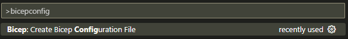

# BOLT - Bicep Operations and Lifecycle Tool

Everything you need to manage your bicep modules to azure container registry.  
Upload multiple bicep modules at the same time with automatic verisioning!

NEWS! BOLT IS NO LONGER JUST A PUBLISHING TOOL!
read more about the new deployment tool [here](./starterpack/readme.md)


---

## What is Bolt?

Bolt is a tool to help you manage your bicep modules. It will take a folder, you define and upload all of the bicep files (within a filter you defined) to an azure container registry.

To help you manage the versions of your modules, Bolt will automatically create a new version for each module you upload depending on the versioning strategy you defined.  
Bolt supports 2 modes of versioning: `static` and `semantic`.  
`static` will upload with the same defined version every time (ex: `latest` or `beta`)  
`semantic` will set major, minor and patch version depending on what you think should trigger the next version. read more about Module release tests and triggers [here](./docs/versionTrigger.md)

To speed up the upload process bolt will build, check and upload all files asynchronously. This means that if you have 10 modules, it will build all of them, then check all of them, then upload all of them. This will speed up the process significantly.

## How do i start?

### Prerequisites

Install atleast powershell 7.2. You can download it below:

* [Windows](https://learn.microsoft.com/en-us/powershell/scripting/install/installing-powershell-on-windows?view=powershell-7.3)
* [Linux](https://learn.microsoft.com/en-us/powershell/scripting/install/installing-powershell-on-linux?view=powershell-7.3)
* [macOs](https://learn.microsoft.com/en-us/powershell/scripting/install/installing-powershell-on-macos?view=powershell-7.3)
* [Arm](https://learn.microsoft.com/en-us/powershell/scripting/install/powershell-on-arm?view=powershell-7.3)
* [Docker](https://learn.microsoft.com/en-us/powershell/scripting/install/powershell-in-docker?view=powershell-7.3)

Install az module version 10 (official microsoft azure powershell module). You can install it with:  
`Find-Module az -MinimumVersion 10.0.0|Install-Module -Force -Scope CurrentUser`

Install bicep, version 17+, but the latest is very stable. [link](https://learn.microsoft.com/en-us/azure/azure-resource-manager/bicep/install)

Install [Git](https://git-scm.com/downloads) (I use git to figure out the root of your project, so you can use the tool from anywhere in your project)

### Prepare your project

* Have a git folder/project with your bicep modules.
* In the root of your project, create a bicepconfig
  * this can also be done though vscode, by having the project open, pressing `Ctrl+Shift+P` and typing `bicepconfig`
   
* inside bicepconfig, set `experimentalFeaturesEnabled.symbolicNameCodegen` to `true`
  * this will allow the tool to generate better output as is adds the name of the different resources to the generated code.
  * The tool will work without it, the output will be less readable and exact. if you have several resources of the same type, i will not be able to check details on them.
* bicepconfig can also be used to enhance linting and best-use cases when writing bicep. Bolt also uses these rules to stop any publish if the bicep file is not valid.
* have a folder ready with your modules.
  * NOTE: Right now, im only supporting what i call `Single Module Folder`, meaning one folder = 1 module.
  * the modules have to be set up with a shared name where the parent folder defines the name of the module.
  * example: if you have a module called `my/module.bicep` the new path for the module will be `my/module/main.bicep`

### Install Bolt

Go into the 'starterpack' folder and download the zip file. Extract it to a folder of your choice (preferably a parent folder of your modules folder).

``` text
|root
    |modules
        |module1
            |main.bicep
        |module2
            |main.bicep
        |module3
            |main.bicep
    |bolt.ps1
    |bolt.json
```


### Configure Bolt

Open bolt.json and configure it to your needs. the starterpack comes with a template file that you can use as a starting point.

Full json schema docs can be found [here](./docs/bolt-schema.md) but i'l do a small tl;dr here:

bicepVersion: the version of bicep you want to use.  
registry: info about the registry you want to upload to.  
module: where to get the modules from and how to organise them.  
publish: how to publish the modules to the registry.  
publish.releasetrigger: how to trigger a new release of a module.  
publish.defaultRelease: if no release is defined when running bolt, what do i use?  
publish.releases: what kind of releases to make. -> this is combined with the run of bolt, as you can define what release you want to make.

### Run Bolt

run `bolt.ps1` with the following possible parameters:

#### -Release 

The Branch/Release Name to use for publish. This is reflected in config.publish.releases

Note:  
`-branch` is to be deprecated, but its a large part of the codebase, so il fix it later on. dont use it, use `-release` instead. its the same parameter.

#### -Name

specific module name to publish. If not specified, all modules will be published.

Supports Wildcard

This is the logical name for the module, not just "filename": path/to/my/module.

If you want to push several modules within the same folder, you can say path/to/my/* and it will push all modules in that folder.

#### -Actions

The actions to perform. Defaults to 'Publish'.

**Publish**: Publish the modules to the registry

**CreateUpdateData**: (NOT ENABLED YET) Creates json with data of what triggered the update. useful for 'whats new' documentation

**CleanRegistry**: Removes repositories not found during discovery (will test agains all modules even if you have a name defined)

**All**: Perform all actions

#### -List

List all modules that will be published

#### -dotsource

**not used by users. really nothing happens**  
Sets script in a dot sourced context.

This is used by all runspaces to import code from the main script.

### End

Really thats it. If you have any questions, feel free to reach out to me 